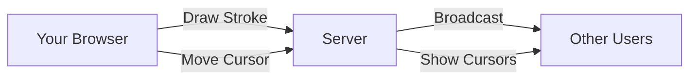

# 🏗 Architecture Guide

Welcome to the technical architecture of Collaborative Canvas! This guide explains how the app works under the hood.

## 🌊 How Data Flows



1. When you draw:
   - Your browser captures the stroke path as you move
   - Sends it to the server when you finish drawing
   - The server broadcasts it to everyone else
   - Other users see your stroke appear instantly

2. For smooth collaboration:
   - Your cursor position is shared in real-time
   - Everyone sees where others are drawing
   - Strokes are drawn incrementally for instant feedback

## 🔌 Real-time Messages

### From Your Browser to Server

```typescript
// When you join a room
join: { 
    roomId: string,    // which room to join
    name: string,      // your display name
    color: string      // your cursor/stroke color
}

// When you move your cursor
pointer: {
    x: number,         // cursor x position
    y: number          // cursor y position
}

// When you finish a stroke
stroke: {
    id: string,        // unique stroke ID
    userId: string,    // who drew it
    path: Point[],     // array of {x,y} points
    color: string,     // stroke color
    width: number,     // stroke width
    tool: 'brush' | 'eraser'
}
```

Also supported: `batch`, `undo`, `redo`, `clear`

### From Server to Your Browser

```typescript
// When you first join
init: {
    users: User[],     // who's in the room
    operations: Op[]   // existing strokes
}

// Real-time updates
stroke: Op             // new stroke from someone
pointer: {            // someone moved their cursor
    id: string,
    x: number,
    y: number,
    color: string
}
users: User[]         // updated user list
```

Also sent: `user-joined`, `user-left`, `undo`, `redo`, `clear`

## ↩️ How Undo/Redo Works

The server keeps two lists:
- `operations`: all the strokes that are currently visible
- `undoStack`: strokes that were undone and can be redone

When you click undo:
1. Server moves the last stroke from `operations` to `undoStack`
2. Tells everyone to remove that stroke
3. Everyone updates their canvas

Redo works in reverse:
1. Server moves a stroke from `undoStack` back to `operations`
2. Tells everyone to redraw that stroke
3. Everyone updates their canvas

**Note:** Currently, undo/redo affects everyone in the room. Future versions could add per-user undo.

## 🚀 Performance Choices

1. **Fast Drawing**
   - Strokes appear instantly on your screen
   - Then sync to others (feels snappy!)
   - Like drawing on paper vs. waiting for server

2. **Light on Memory**
   - Stores everything in RAM (super fast)
   - Tradeoff: clears when server restarts
   - Good enough for a prototype!

## 🔮 Future Improvements

1. **Better Latency Handling**
   - Add sequence numbers to strokes
   - Predict where strokes will go
   - Handle network hiccups smoothly

2. **Personal Undo History**
   - Let each user undo their own strokes
   - Keep track of who drew what
   - More like a real whiteboard!

3. **Save Everything**
   - Store strokes in a database
   - Remember rooms between restarts
   - Send only new changes to save bandwidth
